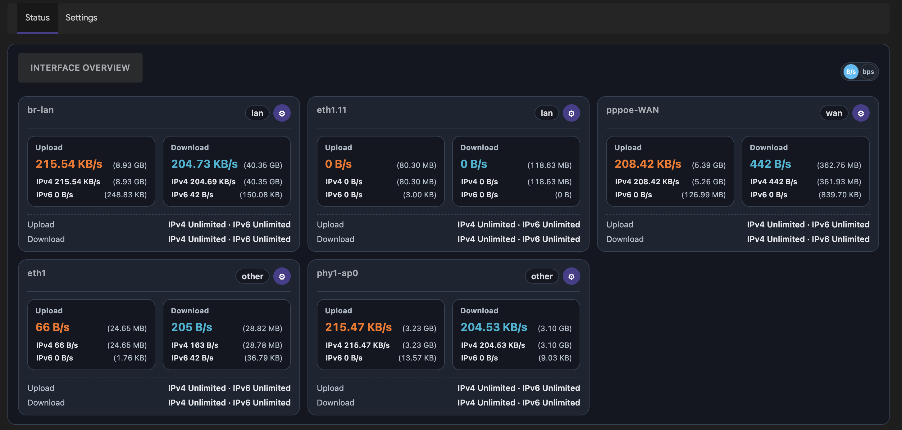
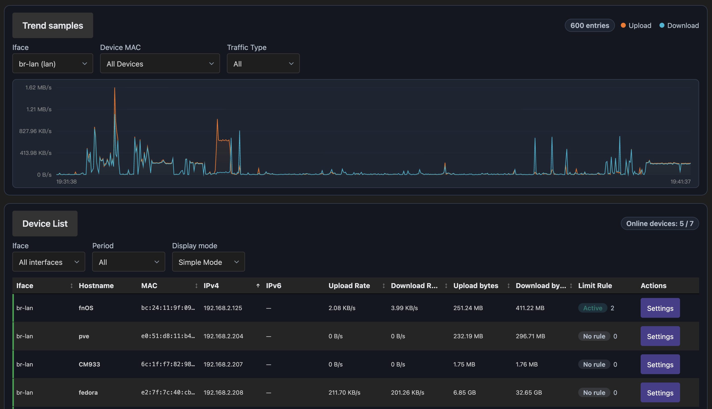
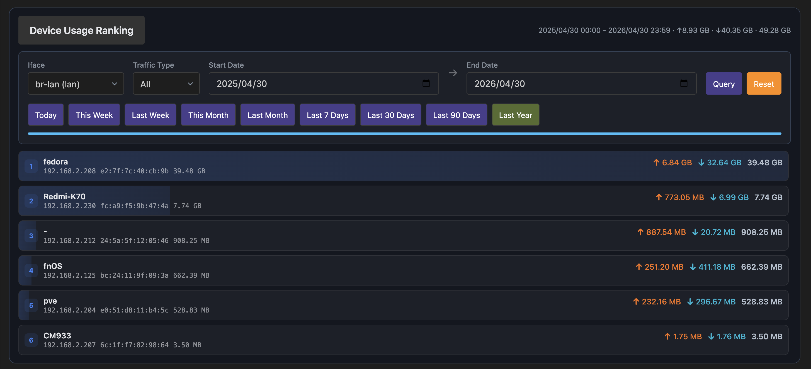

# LuCI Bandix Plus

English | [简体中文](README.zh.md)

[](LICENSE)


## Important

**The `bandix-plus` core is not open source.**

## Overview

LuCI Bandix Plus is a LuCI frontend for `bandix-plus`, designed for OpenWrt traffic monitoring and rate control.
Compared with `luci-app-bandix`, **LuCI Bandix Plus focuses on multi-interface scenarios**.


This project provides a web UI under **Network → Bandix Plus** to view and manage:

- Multi-interface monitoring and management
- Interface overview (upload / download)
- Device list and usage ranking
- Traffic timeline and historical statistics
- Interface rate limits
- Scheduled rate limits
- Guest control rules and whitelist

Typical interfaces include physical ports, VLAN sub-interfaces, PPPoE WAN, and VPN/tunnel interfaces.

## Screenshots








## Requirements

- OpenWrt with LuCI
- `bandix-plus` backend service installed and running
- Linux kernel with eBPF support

Recommended:

- Disable hardware flow offloading / Turbo ACC before using traffic statistics features.

## Installation

Install backend first, then frontend:

```bash
opkg install bandix-plus_*.ipk
opkg install luci-app-bandix-plus_*.ipk
```

After installation:

1. Open LuCI: **Network → Bandix Plus**
2. Configure monitored interfaces
3. Ensure `bandix-plus` service is enabled

## Notes

- This package depends on: `luci-base`, `luci-lib-jsonc`, `curl`, `bandix-plus`.


## License

Apache 2.0. See [LICENSE](LICENSE).
